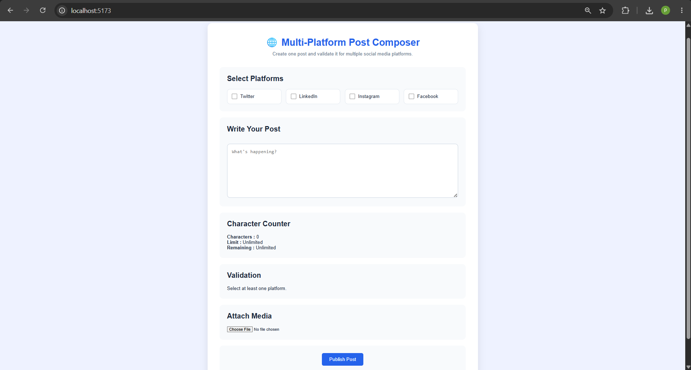
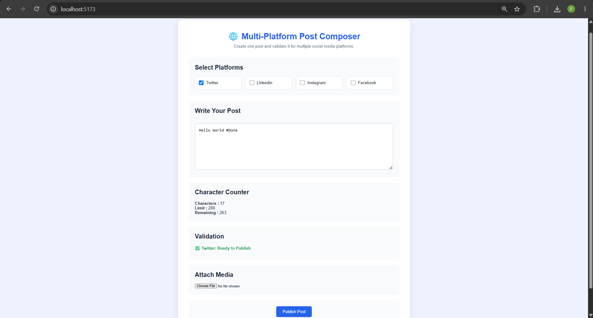
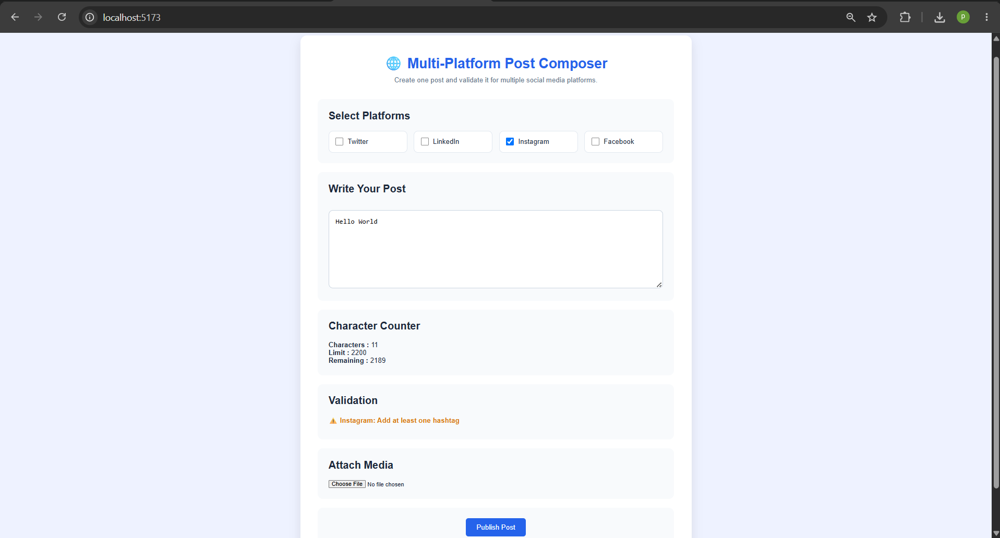
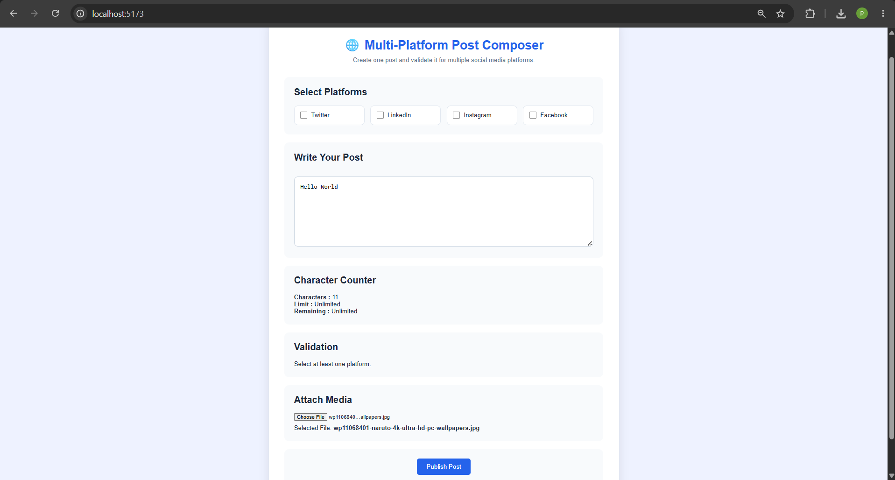

# Experiment 1.1.1 – Dynamic Post Composer

## Aim

To design and develop a dynamic post composer interface supporting multiple platforms with constraint validation.

---

## Objectives

- Understand multi-platform content handling.
- Implement real-time validation mechanisms.
- Design responsive and user-friendly UI components.

---

## Software Requirements

- React.js
- Node.js
- npm
- Visual Studio Code
- Google Chrome

---

## Technologies Used

- React.js
- JavaScript
- HTML5
- CSS3
- Vite

---

## Features

- Multiple platform selection
- Dynamic post editor
- Character counter
- Platform-specific validation
- Media attachment
- Publish button
- Responsive UI

---

## Screenshots

### Home

---

### Validation Success

---

### Validation Error

---

### Media Upload

---

## Expected Outcome

- Working post composer interface
- Platform-specific validation
- Real-time feedback
- Media attachment support

---

## Conclusion

Successfully designed and implemented a dynamic multi-platform post composer using React.js with platform-specific validation and responsive UI.