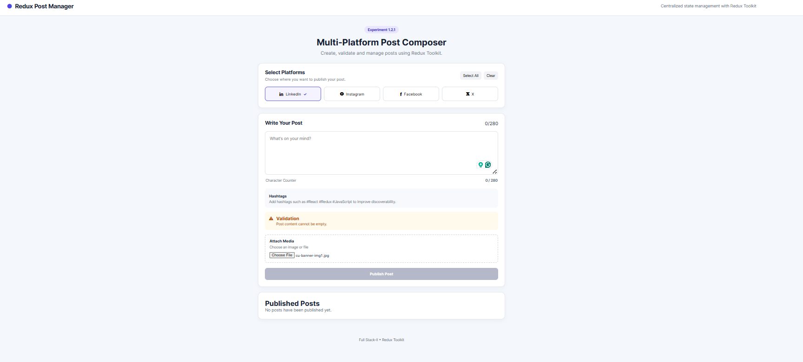
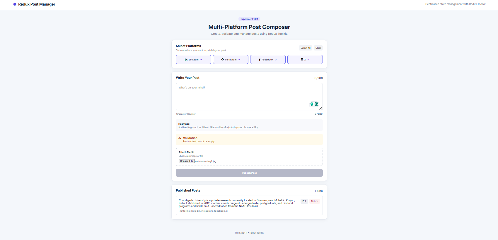
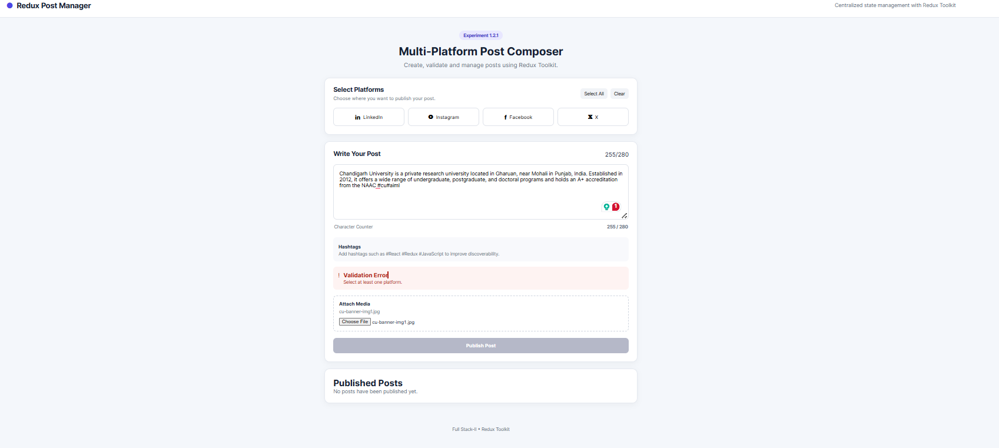

# Experiment 1.2.1 – Redux Toolkit Post Management System

## Aim

To design and implement a centralized state management system using Redux Toolkit for managing posts and platform-related data.

## Objectives

* To understand the concept of global state management.
* To implement Redux Toolkit for scalable state handling.
* To design a normalized state structure.
* To manage asynchronous data flows using a mock API.

## Software Requirements

* Node.js
* npm
* React.js
* Redux Toolkit
* React-Redux
* Visual Studio Code
* Google Chrome

## Technologies Used

* React.js
* JavaScript
* HTML5
* CSS3
* Redux Toolkit
* React-Redux
* Vite

## Description

This project demonstrates centralized state management in a React application using Redux Toolkit.

The application provides a multi-platform post composer where users can select social media platforms, write and validate posts, attach media, and publish posts.

Redux Toolkit is used to maintain application state in a centralized Redux store. Separate slices are created for posts and platforms. The posts slice provides CRUD operations, while the platforms slice manages available and selected platforms.

The application also demonstrates normalized state management using `entities` and `ids`. An asynchronous publishing operation is implemented using `createAsyncThunk()` with a simulated mock API delay.

## Features

* Multiple platform selection.
* Select all and clear platform options.
* Dynamic post editor.
* Real-time character counter.
* Post content validation.
* Platform selection validation.
* Media attachment.
* Asynchronous post publishing.
* Published post listing.
* Edit/update post functionality.
* Delete post functionality.
* Centralized Redux state management.
* Normalized state structure.
* Responsive user interface.

## Redux Architecture

The Redux store contains two major slices:

```text
Redux Store
│
├── posts
│   ├── entities
│   ├── ids
│   ├── status
│   └── error
│
└── platforms
    ├── entities
    ├── ids
    ├── selectedIds
    └── status
```

## Redux Toolkit Implementation

### Store

The Redux store is configured using `configureStore()`.

```javascript
export const store = configureStore({
  reducer: {
    posts: postsReducer,
    platforms: platformsReducer,
  },
});
```

### Posts Slice

The posts slice manages post-related state and provides:

* Add post
* Update post
* Delete post
* Clear posts
* Asynchronous publishing

### Platforms Slice

The platforms slice manages:

* Available platforms
* Selected platforms
* Select all platforms
* Clear selected platforms

## Normalized State

The application uses a normalized state structure:

```javascript
{
  entities: {
    post1: {
      id: "post1",
      content: "Example post"
    }
  },

  ids: ["post1"]
}
```

This structure reduces data duplication and makes individual records easier to access and update.

## Asynchronous Data Flow

The application uses Redux Toolkit's `createAsyncThunk()` for simulated asynchronous post publishing.

The flow is:

```text
User clicks Publish
        ↓
dispatch(publishPost())
        ↓
createAsyncThunk()
        ↓
Mock API delay
        ↓
fulfilled / rejected
        ↓
Redux Store updated
        ↓
React UI re-renders
```

## CRUD Operations

### Create

New posts are added to the Redux store.

### Read

Post data is retrieved using `useSelector()`.

### Update

Existing post content can be modified using the update reducer.

### Delete

Posts can be removed using the delete reducer.

## React Redux Hooks

### useSelector()

`useSelector()` is used to read data from the Redux store.

```javascript
const posts = useSelector(
  (state) => state.posts
);
```

### useDispatch()

`useDispatch()` is used to dispatch Redux actions.

```javascript
const dispatch = useDispatch();

dispatch(deletePost(post.id));
```

## Project Structure

```text
Experiment-01-Post-Composer/
│
├── src/
│   ├── app/
│   │   └── store.js
│   │
│   ├── features/
│   │   ├── posts/
│   │   │   └── postsSlice.js
│   │   │
│   │   └── platforms/
│   │       └── platformsSlice.js
│   │
│   ├── components/
│   │   ├── PlatformSelector.jsx
│   │   ├── PostComposer.jsx
│   │   ├── PostList.jsx
│   │   └── ValidationMessage.jsx
│   │
│   ├── App.jsx
│   ├── main.jsx
│   └── index.css
│
├── screenshots/
│   ├── home.png
│   ├── validation-success.png
│   └── validation-error.png
│
├── package.json
└── README.md
```

## Screenshots

### Home

Add the screenshot of the initial application here.



### Validation Success

Add the screenshot showing successful validation here.



### Validation Error

Add the screenshot showing validation error here.



## Expected Outcome

* Centralized state management system implemented using Redux Toolkit.
* Efficient handling of posts and platform data.
* Reduced prop drilling.
* Normalized and scalable state architecture.
* CRUD operations successfully implemented.
* Asynchronous data flow demonstrated using `createAsyncThunk()`.
* Responsive and maintainable React application developed.
